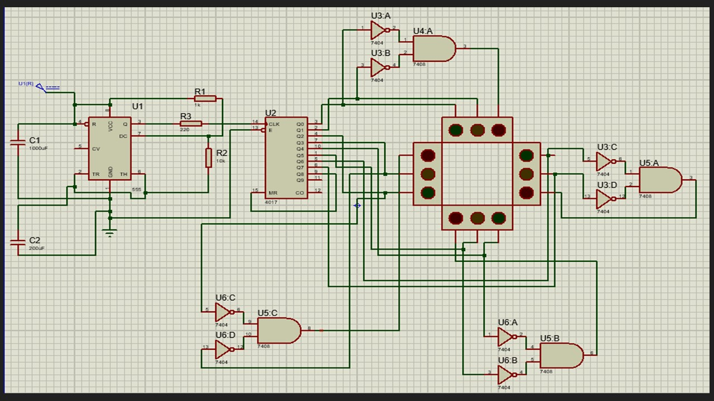

# 4-way-traffic-proteus
Traffic lights, which are also known as traffic signals, traffic lamps and signal lights are signaling devices placed near road intersections, pedestrian crossings and other locations to control the flow of traffic. Traffic lights were first installed in London in 1868. Now they are used in almost every city of the world. Traffic lights alternate displaying lights of a standard color (red, yellow, and green). Vehicles on the road use these lights as guidelines for whether or not to cross the road.

       Red means stop.
       Yellow means wait.
       Green means go.

A simulation circuit was designed using Proteus. A 555 Timer and a 4017 IC were used along with standard NOT and AND gates and 4 sets of Red, Green and Yellow LEDs for the Traffic lights. The simulation circuit is as follows.

This traffic light is made with the help of a counter IC, which is mainly used for Sequential Circuits. We can also call it a Sequential Traffic Light system. Sequential Circuits are used to count the numbers in the series.
Coming to the working principle of Traffic Lights, the main IC is the 4017 counter IC which is used to glow the Red, Yellow and Green LEDs. The 555 timer acts as a pulse generator providing an input to the 4017 counter IC. Timing of the glow of certain lights totally depends upon the 555 timer’s pulse, which we can control via the potentiometer so if you want to change the time of glow, you can do so by varying the capacitances connected. 
